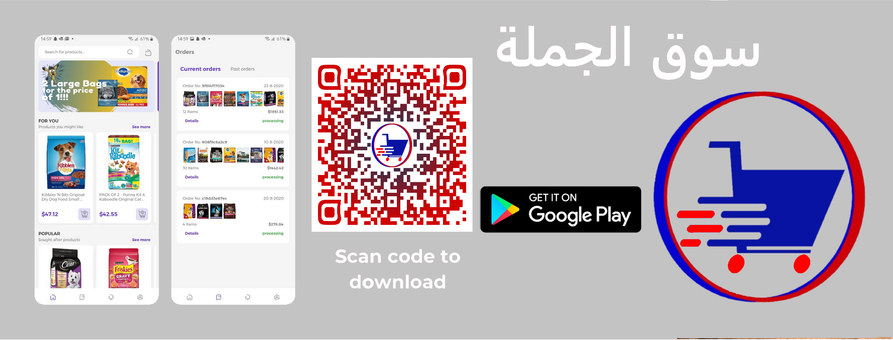
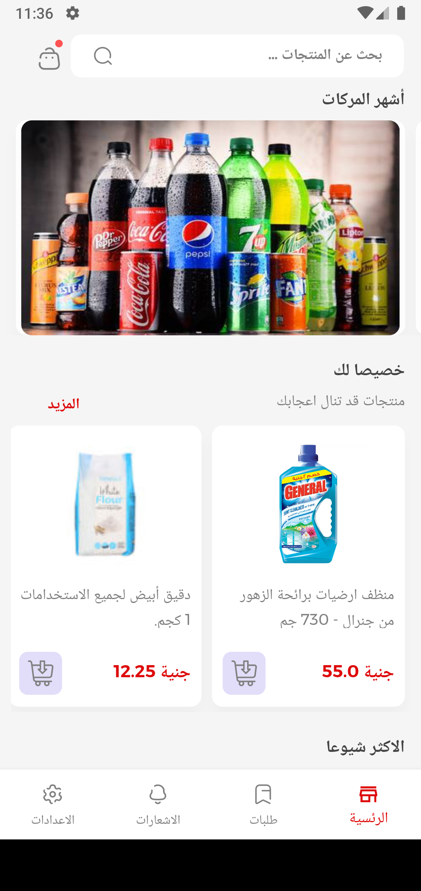
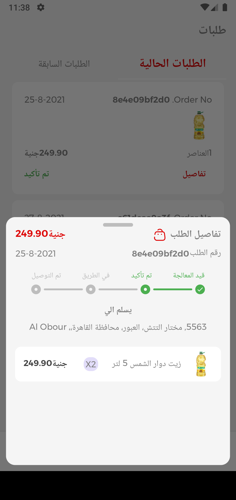
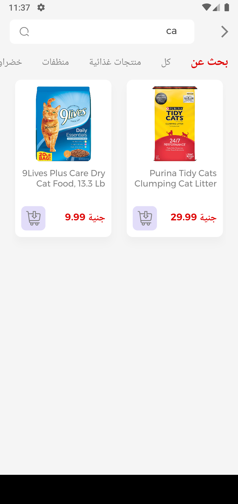
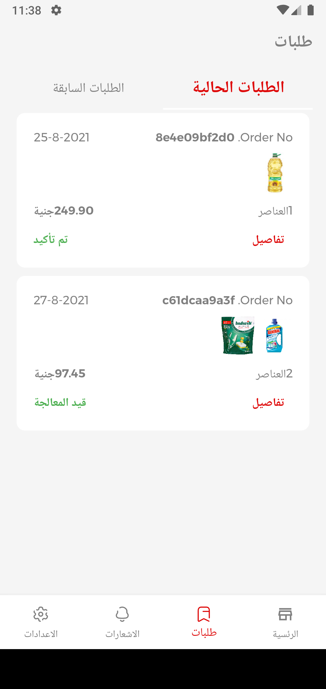
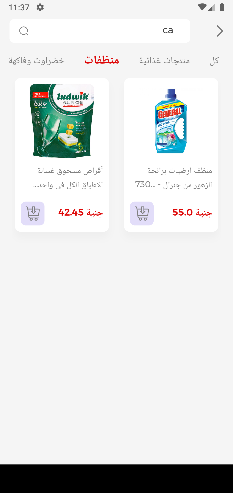
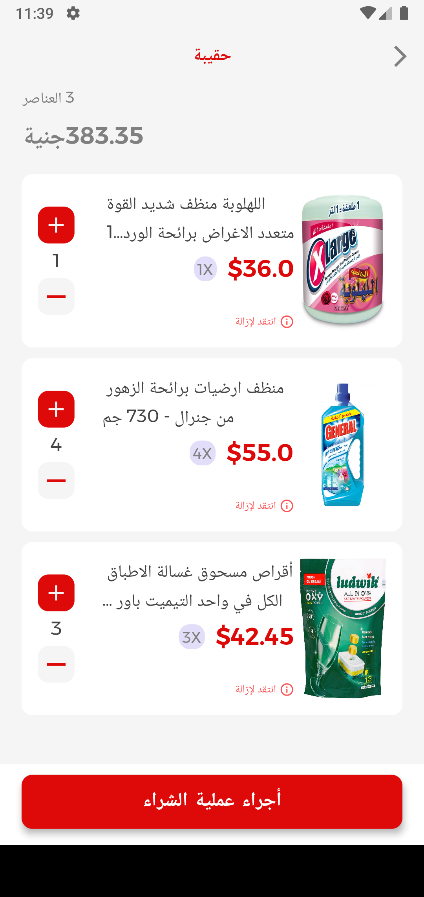
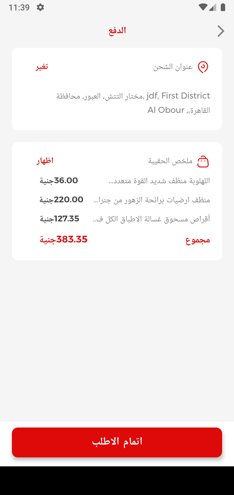
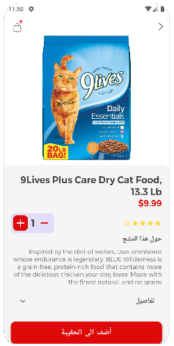
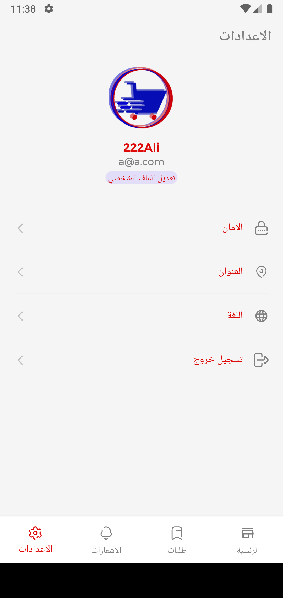

# سوق الجملة


[](https://play.google.com/store/apps/details?id=com.petshop.petshop)
<p>
    
    
    
    
   
   
    
     
     
     

</p>
## Packages Used
```
   flutter_svg: ^1.0.0 #-nullsafety.3
  firebase_auth: ^3.3.4
  url_launcher: ^6.0.17
  cloud_firestore: ^3.1.5
  firebase_messaging: ^11.2.4
  flutter_local_notifications: ^9.2.0
  firebase_core: ^1.10.6
  firebase_storage: ^10.2.4
  google_sign_in:
  flutter_facebook_auth: ^3.5.7
  provider:
  sqflite: ^2.0.1
  google_mobile_ads: ^1.0.1
  google_fonts: ^2.2.0
  wc_flutter_share: ^0.4.0
  carousel_slider: ^4.0.0
  image_picker: ^0.8.4+4
  permission_handler: ^8.2.0
  dio: ^4.0.4
  flutter_launcher_icons: "^0.9.2"
  mask_text_input_formatter: ^2.0.0
  uuid: ^3.0.5
  flutter_localizations:
    sdk: flutter
 
````


## Check out my WebSite >> [Portfolio](https://abdoanany.github.io/)

Souq El-Gomla is an e-commerce application for Android built with Flutter (iOS to come soon). The goal is to implement the Flutter framework for large scale Android and iOS applications, implementing native platform features like camera accessibility, MVC and Provider.

So far, authentication, Google Sign In , FaceBook Sign In, Phone Number with OTP and a couple database (using Firebase) reads and writes have been fully implemented. .


## Design ❄👌
- Support two Language (English,العربية)
- Provider architecture
- MVC
- Web Version (Beta) https://abdoanany.github.io/souq/#/
- FirebaseAuth for authentication
- Firebase Cloud Firestore as backend database
- Fetched store images from Firebase Storge
- Google Sign In , FaceBook Sign In, Phone Number with OTP


## Bugs 😭🐛

If you encounter any bugs or are facing any issues with the code, please don't hesitate to reach out to me.
email : eng.abdelrahman.anany@gmail.com


### Abdelrahman Anany
